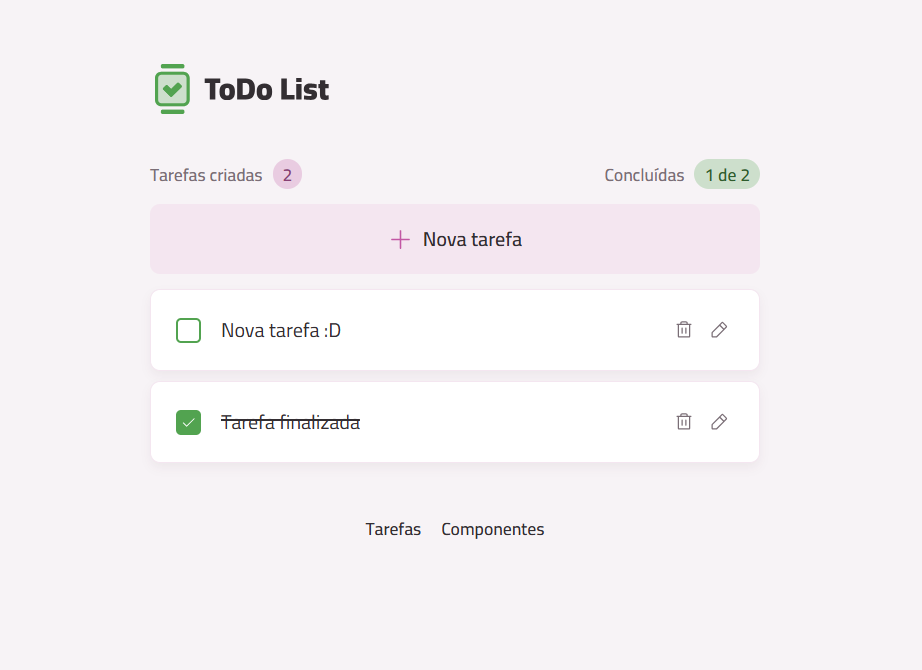

# 📝 React ToDo List

Aplicação de **lista de tarefas (ToDo List)** desenvolvida em **React + TypeScript**, com foco em organização, componentização e boas práticas de front-end moderno.

O projeto permite criar, concluir, editar e remover tarefas, além de exibir métricas simples de produtividade.

---

## 📸 Preview



---

## 🚀 Funcionalidades

- ✅ Criar novas tarefas  
- ✏️ Editar tarefas existentes  
- 🗑️ Remover tarefas  
- ☑️ Marcar tarefas como concluídas  
- 📊 Contador de tarefas criadas  
- 📈 Indicador de tarefas concluídas  

---

## 🧠 Conceitos aplicados

- Componentização
- Estado e imutabilidade
- Tipagem com TypeScript
- Props e eventos
- Condicionais e listas
- Organização de pastas
- Boas práticas de UI/UX

---

## 🛠️ Tecnologias utilizadas

- React
- TypeScript
- Tailwind CSS
- Vite
- CSS Modules
- ESLint
- Git & GitHub

---

## 📂 Estrutura do projeto

```bash
src/
 ├─ components/
 ├─ styles/
 ├─ types/
 ├─ App.tsx
 └─ main.tsx
```

---

## ⚙️ Como executar o projeto

### Pré-requisitos

- Node.js (LTS)
- npm ou yarn

### Passo a passo

```bash
git clone https://github.com/williamdelimacx/react-todo.git
cd react-todo
npm install
npm run dev
```

Acesse: http://localhost:5173

---

## 🎯 Objetivo do projeto

Projeto desenvolvido para praticar **React com TypeScript**, reforçando fundamentos do front-end moderno e servindo como **projeto de portfólio**.

---

## 📄 Licença

Este projeto está sob a licença MIT.
